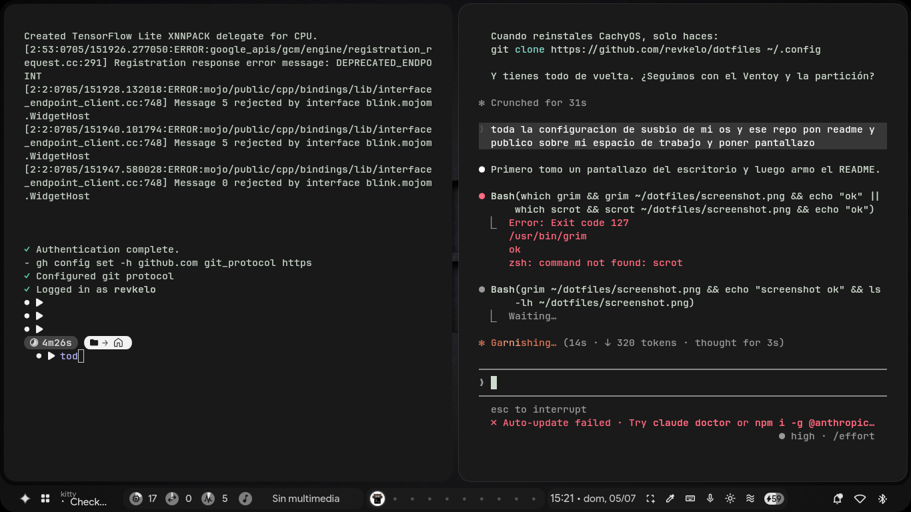

# dotfiles — revkelo

Mi configuración personal de CachyOS con Hyprland. Setup minimalista, rápido y orientado a productividad con IA integrada.



---

## Sistema

| | |
|---|---|
| **OS** | CachyOS (rolling, base Arch) |
| **Kernel** | 7.0.5-2-cachyos (PREEMPT_DYNAMIC) |
| **Compositor** | Hyprland v0.55.1 (config en Lua) |
| **Shell** | Fish 4.7.1 + Starship |
| **Hardware** | Dell Inspiron 15 3515 — AMD Ryzen 5 3450U / Radeon Vega / 13 GB RAM |

---

## Stack principal

| Rol | App |
|---|---|
| Barra / Widgets | Quickshell (`ii` profile) |
| Terminal | Kitty (JetBrains Mono Nerd Font 11pt) |
| Lanzador | Fuzzel |
| Navegador | Chrome |
| Editor | VS Code |
| Explorador | Nautilus |
| Monitor | btop |
| Audio | PipeWire + EasyEffects |
| Tema GTK | adw-gtk3 dark |
| Cursor | Bibata-Modern-Classic 24px |
| Colores | Generados dinámicamente con `matugen` al cambiar wallpaper |

---

## IA integrada

- **Claude Code** — `Super + Alt + C` abre Kitty con Claude Code
- **Sidebar IA** — `Super + A` con soporte para Claude, Gemini, Mistral, DeepSeek
- **LiteLLM proxy** local en `localhost:4099` (API compatible con OpenAI)
- **Consulta rápida** — `Super + Shift + Alt + clic-der` sobre texto seleccionado → notificación con respuesta

---

## Atajos clave

| Atajo | Acción |
|---|---|
| `Super + Return` | Terminal |
| `Super + W` | Chrome |
| `Super + C` | VS Code |
| `Super + R` | Nautilus |
| `Super + Tab` | Overview de workspaces |
| `Super + V` | Historial portapapeles |
| `Super + Shift + S` | Captura de región |
| `Super + L` | Bloquear pantalla |
| `Super + Alt + C` | Claude Code |
| `Super + A` | Sidebar IA |
| `Ctrl + Shift + Escape` | btop |

---

## Estructura de configs

```
~/.config/
├── hypr/
│   ├── hyprland.conf       # Config principal
│   ├── custom/             # ← cambios personales aquí
│   │   ├── keybinds.lua
│   │   ├── variables.lua
│   │   ├── execs.lua
│   │   └── scripts/ai/     # scripts Claude Code
│   └── hypridle.conf
├── fish/                   # shell + aliases
├── quickshell/             # barra y widgets (ii)
├── kitty/                  # terminal
├── fuzzel/                 # lanzador
├── btop/                   # monitor
└── hypr/hyprlock/          # pantalla de bloqueo
```

---

## Restaurar en una instalación nueva

```bash
# Clonar directamente en ~/.config
git clone https://github.com/revkelo/dotfiles ~/.config

# Instalar dependencias principales
sudo pacman -S hyprland fish starship kitty fuzzel btop nwg-drawer quickshell matugen
```

> Los cambios personales de Hyprland van siempre en `~/.config/hypr/custom/`, nunca en `~/.config/hypr/hyprland/`.
