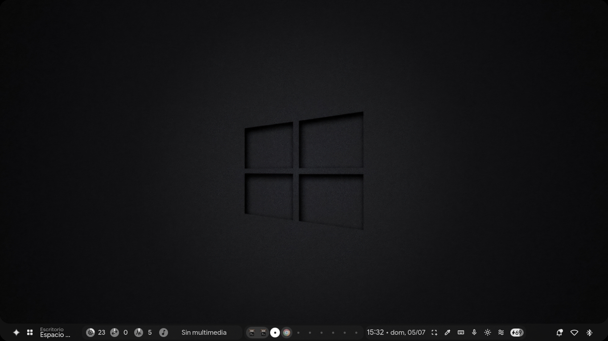
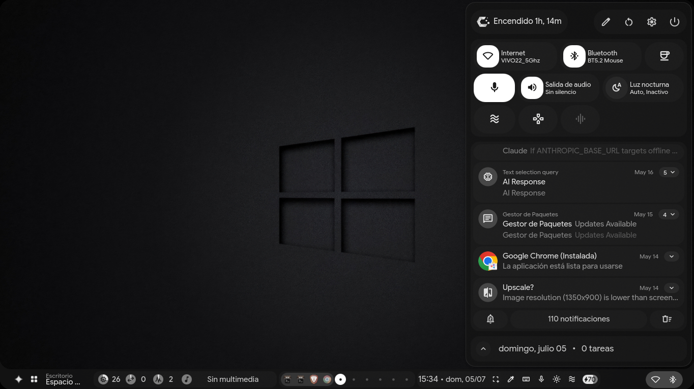
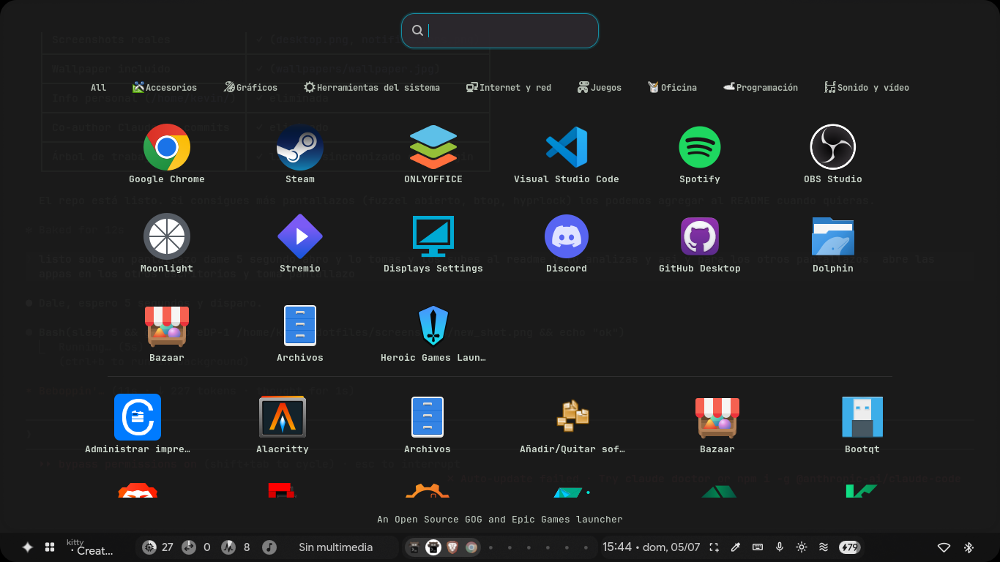
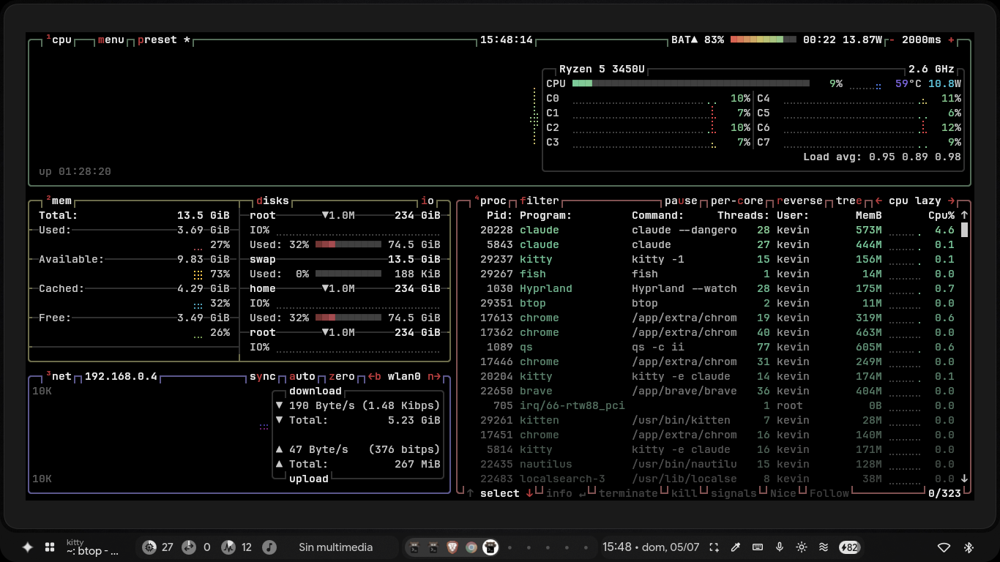
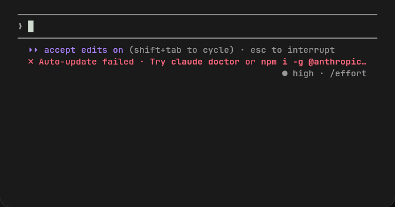

# Hyprland Dotfiles — CachyOS + Claude Code + AI Integration

> Minimal Hyprland rice on CachyOS with native Claude Code integration, AI sidebar, dynamic theming via matugen, and Quickshell widgets.



---

## System

| | |
|---|---|
| **OS** | CachyOS (rolling, Arch-based) |
| **Kernel** | 7.0.5-2-cachyos (PREEMPT_DYNAMIC) |
| **Compositor** | Hyprland v0.55.1 (Lua config) |
| **Shell** | Fish 4.7.1 + Starship |
| **Hardware** | Dell Inspiron 15 3515 — Ryzen 5 3450U · Radeon Vega · 13 GB RAM |

---

## Screenshots

| Desktop | Notification panel |
|---|---|
|  |  |

| App drawer | btop | fastfetch |
|---|---|---|
|  |  |  |

---

## Stack

| Role | App |
|---|---|
| Bar / Widgets | Quickshell (`ii` profile) |
| Terminal | Kitty + JetBrains Mono Nerd Font |
| Launcher | Fuzzel |
| Browser | Chrome |
| Editor | VS Code |
| File manager | Nautilus |
| System monitor | btop |
| Audio | PipeWire + EasyEffects |
| GTK theme | adw-gtk3 dark |
| Cursor | Bibata-Modern-Classic 24px |
| Color scheme | Dynamically generated by `matugen` on wallpaper change |

---

## AI Integration

This setup has Claude Code and multiple AI models wired directly into the desktop — no browser tab needed.

- **Claude Code** — `Super + Alt + C` opens a Kitty terminal with Claude Code ready
- **AI Sidebar** — `Super + A` opens a sidebar with Claude, Gemini, Mistral and DeepSeek support
- **Local LiteLLM proxy** — running on `localhost:4099`, OpenAI-compatible API
- **Quick query** — select any text + `Super + Shift + Alt + right-click` → answer as desktop notification

---

## Keybinds

| Shortcut | Action |
|---|---|
| `Super + Return` | Terminal (Kitty) |
| `Super + W` | Chrome |
| `Super + C` | VS Code |
| `Super + R` | Nautilus |
| `Super + Tab` | Workspace overview |
| `Super + V` | Clipboard history |
| `Super + Shift + S` | Region screenshot |
| `Super + L` | Lock screen |
| `Super + Alt + C` | Claude Code |
| `Super + A` | AI sidebar |
| `Ctrl + Shift + Escape` | btop |

---

## Config structure

Personal Hyprland changes live in `custom/` — never touch the upstream `hyprland/` folder.

```
~/.config/
├── hypr/
│   ├── hyprland.conf
│   ├── custom/             # personal overrides go here
│   │   ├── keybinds.lua
│   │   ├── variables.lua
│   │   ├── execs.lua
│   │   └── scripts/ai/
│   └── hypridle.conf
├── fish/
├── quickshell/
├── kitty/
├── fuzzel/
├── btop/
└── hypr/hyprlock/
```

---

## Install on a fresh system

```bash
git clone https://github.com/revkelo/dotfiles ~/.config

sudo pacman -S hyprland fish starship kitty fuzzel btop nwg-drawer quickshell matugen
```

---

## Keywords

`hyprland dotfiles` · `cachyos hyprland` · `hyprland ai` · `claude code linux` · `hyprland quickshell` · `hyprland rice` · `arch linux dotfiles` · `hyprland matugen` · `ai linux desktop` · `hyprland lua config`
